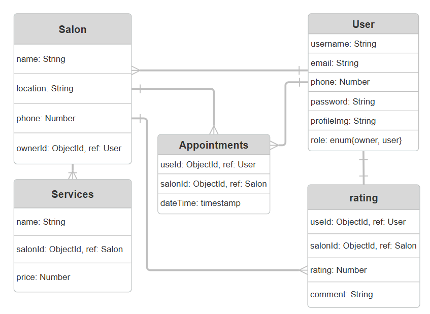

# Book-Glow
## Date: 8/10/2025
### By:
* Zahra Salman Alaali
* Shooq Bin Zaiman
* Fatima Zaid

***

### ***Description***
####

#### With its minimalistic design and modern functionality, BookGlow makes the salon process brief, flexible, and beautifully organized, because beauty never has to be difficult.

#### BookGlow is a full-stack salon appointment booking platform created to revolutionize the interaction between users and their favorite salons. Whether as a client booking your next spa experience or a salon owner managing services and appointments, BookGlow brings it all together in one intuitive, elegant platform.

#### They can simply register, search for the salons, see what services they provide, book or schedule their appointments through a simple and minimalistic interface.

#### Meanwhile, salon owners have full ownership, the autonomy to design extra services, manage appointments, and track bookings all effortlessly, all from their own tailored dashboard.

***

### ***Technologies Used***
* HTML
* CSS
* JAVA SCRIPT
* EJS
* EXPRESS

***

### ***Getting Started***
#### Sign up or sign in as a new user, then explore salons, browse services, and book your appointments effortlessly.

#### A Trello board was used to track development progress and can be viewed [here](https://trello.com/boardinvited/68dd270b846e4395c2f5ba44/68dd2778353cc7bf5fb48947/6bc23424b0161e447ed2b578db3187cd?utm_source=eval-email&utm_medium=email&utm_campaign=board-invite).
#### The project itself was deployed and can be viewed [here]().

***

### ***Screenshots***
#### ERD

#### Wireframe
[Wireframe](https://www.figma.com/proto/cOWrBpZMVUvuhdoyK28fBW/Book---Glow?node-id=0-1&t=wtiKJ1FbfEvCFCzG-1)

***

### ***Future Updates***
- [ ] Add appointment reminders via email or SMS
- [ ] Add payment integration for online booking
- [ ] Implement dark mode
***

### ***Credits***
#### Rating Stars:[codepen](https://codepen.io/hesguru/pen/BaybqXv)
